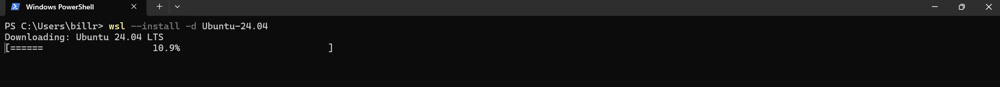

# AI Agent Development Environment Setup

## Operating System
* Linux
* Windows | WSL
* Mac

1. WSL
    * wsl --install -d `<Distro>`
    * wsl --list --online
    * wsl -l -v
    * wsl pwd
    * wsl --install -d Ubuntu-24.04

> *Step-1*: Install Ubuntu-24.04 on Windows with WSL -> `wsl --install -d Ubuntu-24.04`

Wait 5 to 10 minutes depending on your internet speed

2. NodeJS
3. PostgreSQL
4. pgadmin
5. pgvector
6. n8n

## Resource Link
* https://learn.microsoft.com/en-us/windows/wsl/install